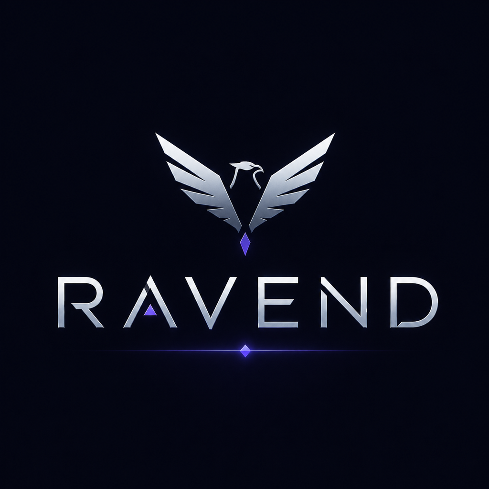

<div align="center">
  
</div>

# Ravend

**Orquestre desenvolvimento assistido por IA com disciplina estruturada — do intake ao código em produção.**

Um harness agentic para substituir prompts dispersos, tracking manual de tarefas e ciclos de review copiados e colados. Ravend conduz o ciclo completo de desenvolvimento assistido por IA dentro do [OpenCode](https://opencode.ai): intake de demanda, especificação de produto, design técnico, decomposição de tarefas, implementação, QA, review e aceite iterativo — tudo com contexto mínimo, estado persistente e especialização por stack.

> **Construção ativa** — Este projeto está em desenvolvimento. Estrutura, skills e comandos podem mudar.

---

## Destaques

- **Disciplina Estruturada de Desenvolvimento (SDD).** Um pipeline comprovado: intake → PRD → tech spec → decomposição → implementação → QA → review → loop até aceite. Cada fase produz artefatos markdown que alimentam a próxima. Comece de uma demanda bruta para rastreabilidade completa, ou pule direto para implementação quando o escopo já estiver claro.

- **Roteamento por stack.** Ravend detecta a stack dominante (Quarkus, Spring, Angular) e carrega skills especializadas sob demanda — checklists de implementação, padrões de review e convenções específicas do seu framework. Nada de conselho genérico; cada ação é fundamentada na realidade da sua codebase.

- **Minimalismo de contexto.** Sem despejar o repositório inteiro. Ravend carrega apenas o contexto necessário para a fase e tarefa atual, persiste estado em arquivos e compacta sessões longas automaticamente. Resultado: menor custo de tokens, execução mais rápida e menos risco de alucinação.

- **Estado persistente, fluxos retomáveis.** Cada execução SDD persiste seu estado em [`.lla/sdd/current/`](./.lla/sdd/current/). Interrompa um fluxo, feche sua sessão e retome exatamente de onde parou com `/sdd-resume`. Sem contexto perdido, sem trabalho repetido.

- **Harness auto-otimizável.** Ravend pode auditar e evoluir sua própria configuração — agentes, skills, commands, arquivos de contexto e economia de tokens. Execute `/ravend-optimize` para uma análise crítica, ou `/ravend-evolve` para propor e executar melhorias incrementais.

- **Captura incremental de conhecimento.** Findings recorrentes são destilados em entradas compactas e indexadas em [`.lla/knowledge/`](./.lla/knowledge/), organizadas por papel (reviewer, implementer, shared). Conhecimento é carregado seletivamente — nunca tudo de uma vez. Consulte [`knowledge-index.json`](./.lla/knowledge/knowledge-index.json) para o catálogo.

- **Markdown primeiro, JSON para contratos.** Markdown legível para specs, PRDs e decisões. JSON legível por máquina para manifests operacionais e handoffs. Tudo versionável, diffável e editável entre etapas.

---

## Como Funciona

```
  intake → PRD → tech spec → decomposição → implementação → QA → review → aceite
    ↑                                                                              │
    └────────────────────────────── loop até aceite ───────────────────────────────┘
```

1. **Intake** — Normaliza uma demanda bruta, ticket ou item Jira em um brief estruturado e acionável.
2. **PRD** — Produz um Documento de Requisitos de Produto proporcional à complexidade.
3. **Tech Spec** — Traduz o PRD em uma solução técnica implementável.
4. **Decomposição** — Quebra a spec em tarefas pequenas, verificáveis e com critérios de aceite.
5. **Implementação** — Executa uma tarefa por vez com skills da stack e contexto mínimo.
6. **QA** — Verifica com o menor conjunto suficiente de testes e build.
7. **Review** — Valida aderência ao escopo, spec, convenções e riscos. Aceita, rejeita ou solicita correções.
8. **Loop** — Itera até aceite. Depois captura aprendizados e arquiva.

Cada fase produz artefatos em [`.lla/sdd/current/`](./.lla/sdd/current/) e contratos operacionais em [`.lla/manifests/`](./.lla/manifests/).

### Fast Path

Nem toda mudança precisa do pipeline completo. Ravend prefere o **menor caminho seguro** — se já existe plano suficiente ou o escopo é trivial, pula direto para implementação. O fluxo SDD é o padrão, não uma camisa de força.

---

## Quick Start

### 1. Abra este repositório no OpenCode

Ravend roda como orquestrador residente dentro do [OpenCode](https://opencode.ai). Ao abrir este repo, o runtime carrega automaticamente:

- Identidade e regras em [`AGENTS.md`](./AGENTS.md)
- Configuração de agentes em [`opencode.json`](./opencode.json)
- Contexto estável em [`.lla/context/`](./.lla/context/)
- Templates em [`.lla/templates/`](./.lla/templates/)

### 2. Inicie um fluxo de desenvolvimento

```
/sdd-start Adicionar autenticação de usuário com JWT
```

Ravend executa o intake, produz PRD e tech spec se necessário, decompõe em tarefas e conduz a implementação até QA e review.

### 3. Comece a partir do Jira

```
/sdd-jira PROJ-1234
```

Puxa o item do Jira, normaliza via intake e segue o mesmo pipeline.

### 4. Retome um fluxo interrompido

```
/sdd-resume
```

Lê o estado persistido em [`.lla/sdd/current/`](./.lla/sdd/current/) e continua de onde parou.

### 5. Execute uma fase específica

```
/sdd-implement task_03
/sdd-qa task_03
/sdd-review task_03
/sdd-accept
```

Cada command ataca uma fase específica. Use quando você já sabe o que precisa acontecer.

---

## Commands

| Command | Finalidade |
|---|---|
| `/sdd-start <demanda>` | Inicia um fluxo SDD completo a partir de uma demanda textual |
| `/sdd-jira <chave>` | Inicia um fluxo SDD completo a partir de um item Jira |
| `/sdd-resume` | Retoma o fluxo atual a partir do estado persistido |
| `/sdd-implement <escopo>` | Executa implementação de uma tarefa ou escopo delimitado |
| `/sdd-qa <escopo>` | Executa verificação de QA com o menor conjunto suficiente de testes |
| `/sdd-review <escopo>` | Revisa mudanças contra escopo, spec e convenções |
| `/sdd-accept` | Consolida aceite quando QA e review estão satisfatórios |
| `/ravend-whoami` | Explica quem é o Ravend, como está configurado e o que está ativo |
| `/ravend-optimize` | Analisa o harness e sugere otimizações |
| `/ravend-evolve <alvo>` | Propõe ou executa evolução incremental do harness |

Definições completas em [`.opencode/commands/`](./.opencode/commands/).

---

## Agentes

Ravend delega para agentes especializados, cada um com papel claro:

| Agente | Papel |
|---|---|
| [`orchestrator`](./.opencode/agents/orchestrator.md) | Agente primário. Escolhe o menor caminho seguro, persiste estado, coordena o pipeline |
| [`intake`](./.opencode/agents/intake.md) | Normaliza demandas brutas em briefs estruturados e acionáveis |
| [`spec-writer`](./.opencode/agents/spec-writer.md) | Produz PRDs e refina especificações de produto |
| [`planner`](./.opencode/agents/planner.md) | Identifica stack dominante, seleciona skills, evita planos inflados |
| [`task-decomposer`](./.opencode/agents/task-decomposer.md) | Quebra specs em tarefas pequenas, verificáveis e implementáveis |
| [`implementer`](./.opencode/agents/implementer.md) | Implementa uma tarefa delimitada com skills da stack |
| [`qa`](./.opencode/agents/qa.md) | Valida tecnicamente; registra resultados e lacunas |
| [`reviewer`](./.opencode/agents/reviewer.md) | Revisa contra escopo, spec e convenções; decide aceite |
| [`knowledge-curator`](./.opencode/agents/knowledge-curator.md) | Destila findings recorrentes em entradas compactas e indexadas |

---

## Skills

Skills são carregadas sob demanda — nunca todas de uma vez. Elas fornecem procedimentos específicos por stack e por processo.

### Skills de Processo (SDD)

| Skill | Finalidade |
|---|---|
| `sdd-intake` | Normaliza demanda em intake estruturado |
| `sdd-prd` | Produz ou refina um PRD |
| `sdd-tech-spec` | Traduz PRD em tech spec implementável |
| `sdd-task-decomposition` | Quebra spec em tarefas com critérios de aceite |
| `sdd-implementation` | Guia a implementação de uma tarefa |
| `sdd-qa-verification` | Verifica com o menor conjunto suficiente de testes e build |
| `sdd-review-loop` | Revisa, decide aceite, gera feedback acionável |
| `sdd-context-compaction` | Compacta estado de sessões longas em arquivos persistentes |
| `sdd-knowledge-capture` | Converte findings recorrentes em conhecimento reutilizável |

### Skills de Stack

| Skill | Finalidade |
|---|---|
| `quarkus-implementation` | Padrões e checklist de implementação para Quarkus |
| `quarkus-review` | Checklist de review para codebases Quarkus |
| `spring-implementation` | Padrões e checklist de implementação para Spring |
| `spring-review` | Checklist de review para codebases Spring |
| `angular-implementation` | Padrões e checklist de implementação para Angular |
| `angular-review` | Checklist de review para codebases Angular |
| `stack-routing` | Identifica stack dominante e seleciona skills corretas |

### Skills Meta

| Skill | Finalidade |
|---|---|
| `ravend-harness-optimization` | Analisa e otimiza o próprio harness Ravend |
| `ravend-self-evolution` | Guia a evolução incremental do sistema agentic Ravend |

Definições completas em [`.opencode/skills/`](./.opencode/skills/).

---

## Estrutura do Repositório

```
.
├── AGENTS.md                          # Identidade e regras globais do Ravend
├── opencode.json                      # Configuração do OpenCode para o repo
├── .opencode/
│   ├── agents/                        # Definições de agentes (orchestrator, implementer, qa, etc.)
│   ├── skills/                        # Definições de skills (SDD, por stack, meta)
│   └── commands/                      # Portas de entrada de commands CLI
├── .lla/
│   ├── context/                       # Contexto estável do projeto
│   │   ├── project.md                 # Missão do produto, domínio, restrições
│   │   ├── architecture.md            # Estrutura do repo, módulos, fronteiras
│   │   ├── conventions.md             # Padrões de código, nomenclatura, testes
│   │   ├── stack.md                   # Linguagens, frameworks, build, heurísticas
│   │   ├── ravend-identity.md         # Identidade operacional do Ravend
│   │   └── ravend-optimization.md     # Princípios de auto-otimização
│   ├── sdd/
│   │   └── current/                   # Estado do fluxo SDD ativo
│   ├── manifests/                     # Contratos JSON de tasks, handoffs e knowledge
│   ├── knowledge/                     # Base de memória incremental e seletiva
│   │   ├── reviewer/                  # Conhecimento específico do reviewer
│   │   ├── implementer/               # Conhecimento específico do implementer
│   │   └── shared/                    # Conhecimento entre papéis
│   └── templates/                     # Templates de PRD, tech spec, task e knowledge
```

---

## Princípios de Design

- **Menor caminho seguro.** SDD completo quando necessário; fast path quando suficiente.
- **Minimalismo de contexto.** Carrega apenas o que a fase atual exige. Persiste o resto em arquivos.
- **Consciente da stack, não acoplado.** Especialização entra via skills, não via lógica hardcoded.
- **Auto-melhorável.** Ravend pode auditar, otimizar e evoluir seu próprio harness.
- **Sem vendor lock-in.** Todos os artefatos são markdown e JSON. Versionáveis, diffáveis, editáveis.
- **"Não alterar nada" é válido.** Quando a melhor decisão é nenhuma decisão, o Ravend diz isso.

---

## Stacks Suportadas

| Stack | Implementação | Review |
|---|---|---|
| Quarkus | `quarkus-implementation` | `quarkus-review` |
| Spring | `spring-implementation` | `spring-review` |
| Angular | `angular-implementation` | `angular-review` |

Stacks adicionais podem ser adicionadas criando novos diretórios de skill em [`.opencode/skills/`](./.opencode/skills/).

---

## Auto-Otimização

Ravend tem consciência da própria arquitetura. Quando você pede para otimizar:

- Audita agentes, skills, commands, manifests e arquivos de contexto
- Identifica duplicação, inflação e complexidade desnecessária
- Sugere remoções, consolidações e simplificações
- Aponta trade-offs de economia de tokens e riscos de alucinação
- Propõe evolução incremental com before/after claro

Execute `/ravend-optimize` para análise, ou `/ravend-evolve` para execução. Veja os critérios de otimização em [`.lla/context/ravend-optimization.md`](./.lla/context/ravend-optimization.md).

---

## Licença

Este projeto é fornecido como-is para uso com OpenCode. Veja arquivos individuais para termos aplicáveis.
